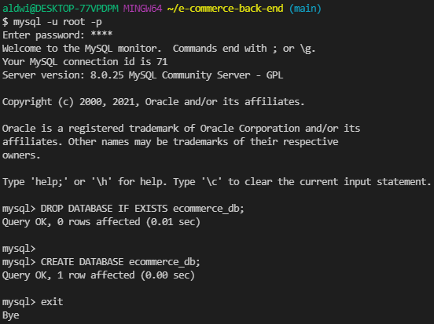
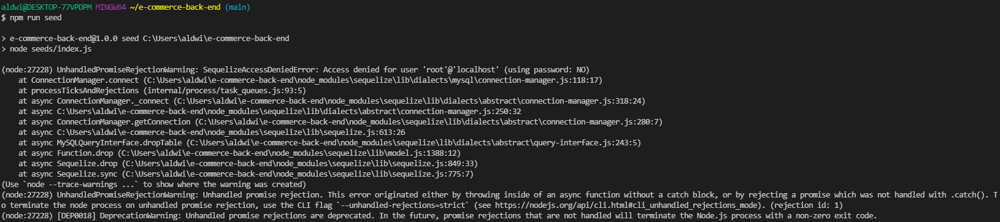
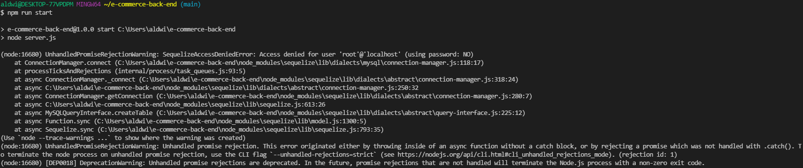

# e-commerce-back-end

## Overview:
In this project, the back end application was built to complete an internet retail shop which is one of the largest sectors of the electronics industry and is also known as e-commerce.

The task was to build the back end for an e-commerce site by modifying starter code. This application was accomplished through a working Express.js API which allows the use of Sequelize in order to interact with a MySQL database. Api routes were created which allows the user to GET, POST, PUT, and DELETE requests for the models of Category, Product, and Tag.

Some complications while building the app was seeding the seeds with npm run seed. This was difficult to try to fix due to an error regarding having a denied access to 'root'@'localhost'. Even with the commands 'mysql -u root -p' was not helpful.

## User Story

AS A manager at an internet retail company
I WANT a back end for my e-commerce website that uses the latest technologies
SO THAT my company can compete with other e-commerce companies

## GitHub Repository Link:

https://github.com/aldwinlub/e-commerce-back-end

## Screenshots:
Running the command 'mysql -u root -p' and pasting in the database:

Attempting to seed:

Attempting to run the start command:
